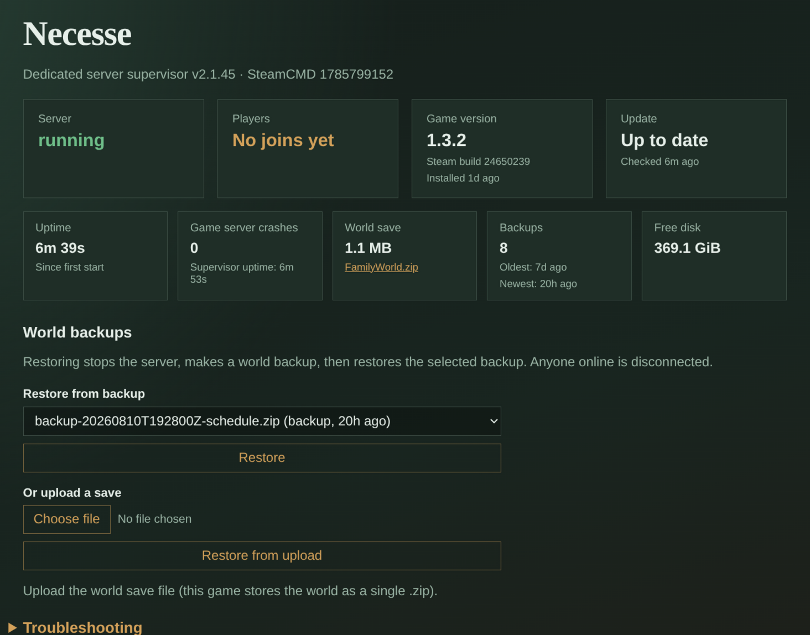
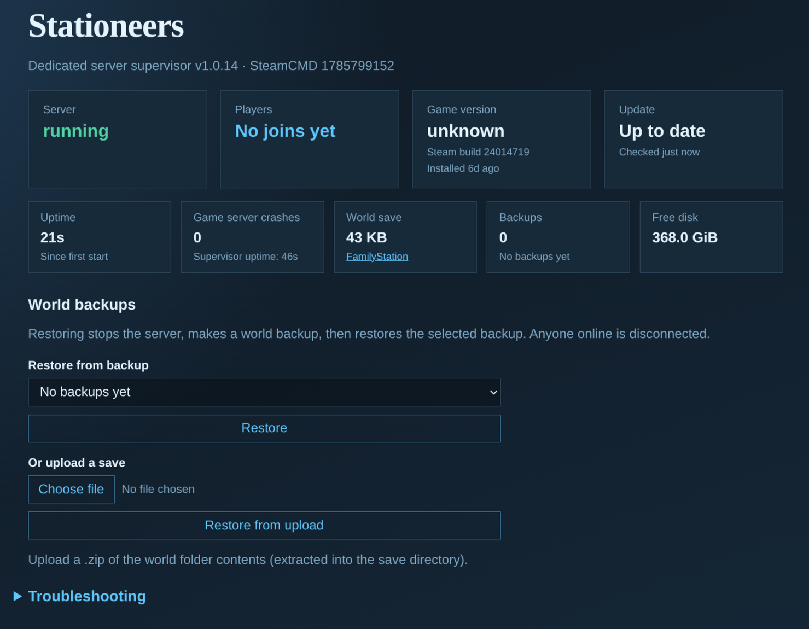
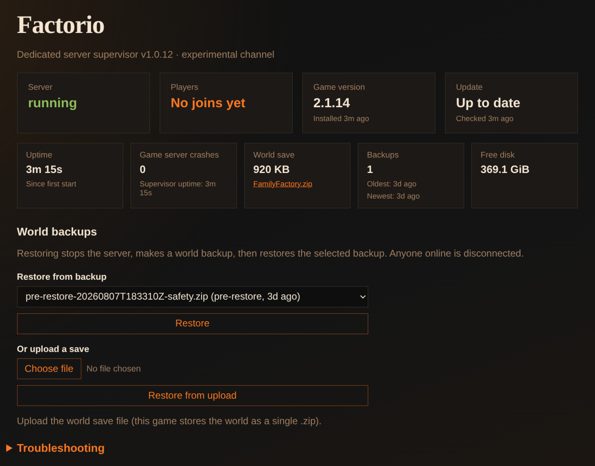

# esper256 Home Assistant add-ons

Dedicated game servers for **Home Assistant OS** (and plain Docker).  
Most titles update through SteamCMD; **Factorio** uses Wube’s free headless package from factorio.com. Each app backs up the world, can restart after crashes, and ships an **OPEN WEB UI** (Ingress) for status, restore, and troubleshooting.

> **AI experiment:** This repository is a deliberate experiment in AI-assisted coding. The add-ons work and are useful, but the project has been **100% written with AI**.

## Games

| Game | In-app docs | Store blurb |
| --- | --- | --- |
| **Necesse** | [DOCS.md](necesse-dedicated-server/DOCS.md) | [README.md](necesse-dedicated-server/README.md) |
| **Stationeers** | [DOCS.md](stationeers-dedicated-server/DOCS.md) | [README.md](stationeers-dedicated-server/README.md) |
| **Factorio** | [DOCS.md](factorio-dedicated-server/DOCS.md) | [README.md](factorio-dedicated-server/README.md) |

Home Assistant shows each game folder’s `README.md` in the App store and `DOCS.md` on the Documentation tab after install. This root README is the GitHub landing page (install, Docker, screenshots).

### Necesse



SteamCMD dedicated server. Default world `FamilyWorld`, player port **UDP 14159**.

- In-app docs: [necesse-dedicated-server/DOCS.md](necesse-dedicated-server/DOCS.md)
- Changelog: [necesse-dedicated-server/CHANGELOG.md](necesse-dedicated-server/CHANGELOG.md)

### Stationeers



SteamCMD dedicated server (Debian Trixie image for glibc). Default save `FamilyStation` / map `Mars2`. Ports **UDP 27016** (game) + **UDP 27015** (Steam query).

- In-app docs: [stationeers-dedicated-server/DOCS.md](stationeers-dedicated-server/DOCS.md)
- Changelog: [stationeers-dedicated-server/CHANGELOG.md](stationeers-dedicated-server/CHANGELOG.md)

### Factorio



Free factorio.com headless package (not SteamCMD). Default save `FamilyFactory`, player port **UDP 34197**. Stable or experimental channel; Space Age DLC optional.

- In-app docs: [factorio-dedicated-server/DOCS.md](factorio-dedicated-server/DOCS.md)
- Changelog: [factorio-dedicated-server/CHANGELOG.md](factorio-dedicated-server/CHANGELOG.md)

## Install in Home Assistant

Needs an **amd64** HAOS host. On aarch64 the App store will not offer these apps.

1. **Settings → Apps → App store → ⋮ → Repositories** → add:

   ```text
   https://github.com/esper256/hassio-addons
   ```

2. Install the game app from that repository.
3. Open the app’s **Documentation** tab for configuration, ports, and **OPEN WEB UI**.
4. Configure → **Start** → port-forward → join from the game client.

Only folders with `config.yaml` appear in the store. `game-server-base/` is shared supervisor code, not an installable app.

## Docker / Portainer

Each game folder has a `docker-compose.yml`. Example:

```bash
docker compose -f necesse-dedicated-server/docker-compose.yml up -d --build
```

Set passwords / world names in the compose environment. Status UI binds to **localhost:8099** only (no Home Assistant Ingress auth outside HA — do not expose 8099 publicly). Data: `./data` → `/data`.

| Game | Player ports | Compose |
| --- | --- | --- |
| Necesse | UDP 14159 | [necesse-dedicated-server/docker-compose.yml](necesse-dedicated-server/docker-compose.yml) |
| Stationeers | UDP 27016 + 27015 | [stationeers-dedicated-server/docker-compose.yml](stationeers-dedicated-server/docker-compose.yml) |
| Factorio | UDP 34197 | [factorio-dedicated-server/docker-compose.yml](factorio-dedicated-server/docker-compose.yml) |

## Data layout (typical)

```text
/data/game/          # Game install (Steam or package)
/data/world/         # Saves / write-data
/data/logs/          # Optional file logs
/data/backups/       # World backups (scheduled, pre-update, pre-restore)
/data/supervisor/    # status.json, gates, log captures
```

## Add another Steam game

The shared supervisor is game-agnostic. Copy an existing game add-on, point `games/game.yaml` at your dedicated server, and keep game identity out of `game-server-base/`.

→ [How to package a game](game-server-base/README.md)

## Layout

| Path | Role |
| --- | --- |
| `necesse-dedicated-server/` | Necesse app (`README` store blurb, `DOCS` in-app guide) |
| `stationeers-dedicated-server/` | Stationeers app |
| `factorio-dedicated-server/` | Factorio app |
| `game-server-base/` | Shared supervisor; sync into game apps with `sync-into-addons.sh` |
| `tests/` | Repo checks for HA app `config.yaml` rules |
