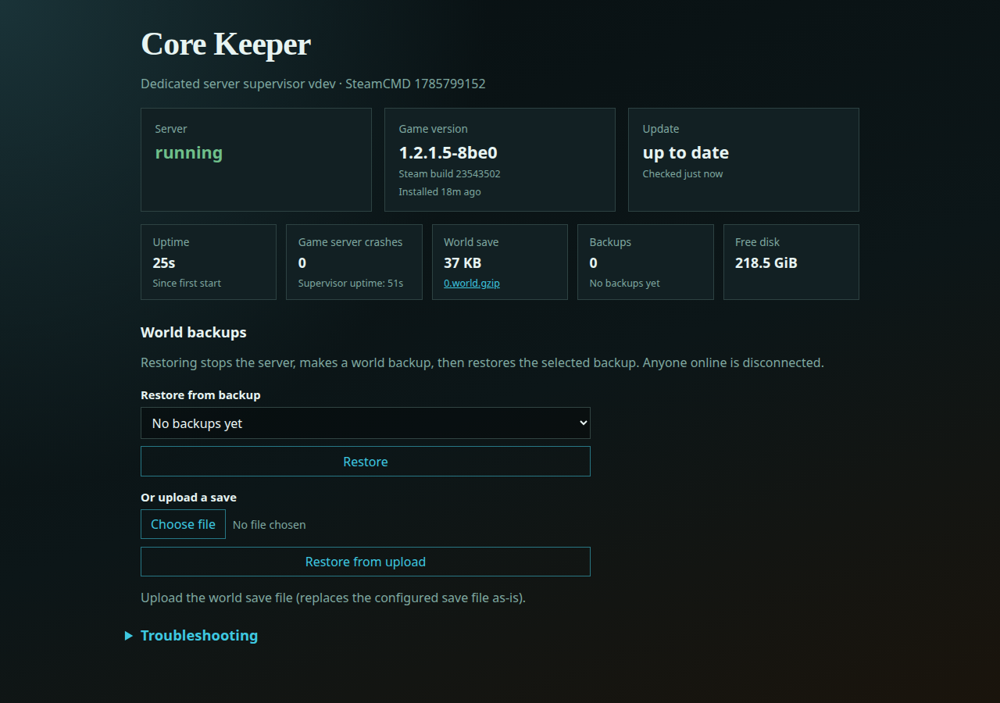

# Core Keeper Dedicated Server

Run a **[Core Keeper](https://store.steampowered.com/app/1621690/Core_Keeper/)** dedicated multiplayer server on Home Assistant OS (or Docker).  
SteamCMD keeps the build current, the world is backed up automatically, and **Open Web UI** (Ingress) is the day-to-day control surface.



> Looking at this from inside Home Assistant? Use the app’s **Documentation** tab (`DOCS.md`) for configure/start. This page is the GitHub guide.

---

## What you get

- SteamCMD install and updates (`public` or `beta` branch)
- **Private by default:** Game ID join via Steam Datagram Relay. There is no public server browser listing and no published UDP game port. Anyone who should play needs the Game ID (treat it like a password)
- Player-aware update restarts (join/leave detection once patterns are promoted)
- Several world **slots** on one install (`0.world.gzip` …); Open Web UI backs up the active slot
- Generational world backups, plus pre-update and pre-restore safety copies
- **Open Web UI**: status, players, game version / updates, world download, restore, upload, troubleshooting
- HA notifications for crash / update failure / version mismatch
- Image includes Xvfb — Pugstorm’s dedicated server needs a virtual display (world gen uses the GPU; `-nographics` is not supported)

**Architecture:** amd64 only (SteamCMD). Not offered on aarch64 HAOS.

---

## Install in Home Assistant

1. **Settings → Apps → App store → ⋮ → Repositories** → add:

   ```text
   https://github.com/esper256/hassio-addons
   ```

2. Install **Core Keeper Dedicated Server**.
3. Open the app → **Documentation** tab for configuration, Game ID join, and Open Web UI notes.
4. Set at least **World name**. Leave **Game ID** blank. Leave the default **World slot** `0` unless you already keep several caverns. The server stays **private** (invite-only Game ID) — there is nothing to turn off for listing.
5. **Start**. First Steam download is ~650 MB.
6. Copy the **Game ID** from **Logs** (`Game ID: …`). Do not post it in a public Discord/forum if you want the cavern private.
7. In Core Keeper → **Multiplayer** → **Join Game**, paste that Game ID.

With the app started, use **Open Web UI** on the Info tab (optional: **Show in sidebar**).

---

## Open Web UI

Ingress status page (no extra host port to publish):

- Server / players / game version / update
- World save download, backups, restore, and upload
- Collapsed **Troubleshooting** (log captures and JSON API)

Restoring stops the server, makes a world backup, then restores the selected backup. Anyone online is disconnected.

---

## Joining (Game ID, not IP)

Core Keeper’s dedicated server, with **no `-port`**, uses **Steam Datagram Relay**. Players paste a Game ID in-game. That is the default this app ships: **invite-only**, not listed on a public browser, no game UDP port on the router.

The Game ID is stable for this install when **Game ID** is left blank (generated once from a salt on `/data/supervisor`, reused on restart, recovered from `GameID.txt` / `ServerConfig.json` if that salt is missing). Pin one only if you already have a code you want to keep. An invalid pin is ignored rather than passed through (Pugstorm would otherwise mint a **new random** ID and friends would bounce).

Wiping the whole add-on data disk is a new install and gets a new Game ID. Restoring a Home Assistant backup of this app restores the salt (and the world), so the join code stays put.

### Lag and Direct Connect

Steam Datagram Relay sends traffic through Valve’s relay. That avoids port-forwarding and keeps the host IP off the wire, and it can add latency — the same thing people notice on some Steam-hosted sessions.

Pugstorm’s other mode is **Direct Connect**: pass `-port`, forward that UDP port, and players can join by IP (cross-play) while Steam users can still use the Game ID. IPs are then shared with players; a `-password` applies only to IP join (the Game ID remains the secret for relay join). This app **does not** turn that on. There is no SDR quality slider in the dedicated server. Direct Connect is the official way to cut relay lag, and it is a different network/privacy model (published UDP port, HA `ports:`, IP sharing). Default stays private Game ID join.

---

## World slots

The dedicated server keeps many caverns in one datapath: `worlds/0.world.gzip`, `worlds/1.world.gzip`, … (official index **0–29**). **World slot** (`-world`) selects which file this process hosts. Open Web UI backups/download/upload follow the **active** slot. Switching slot does not delete the previous file; it just hosts a different one. Seed and world mode apply only when that slot’s file does not exist yet.

---

## Docker / Portainer

```bash
docker compose -f core-keeper-dedicated-server/docker-compose.yml up -d --build
```

Set `WORLD_NAME` in the compose environment. Leave `GAME_ID` unset for a stable generated join code. Status UI on **localhost:8099** only (no Ingress auth outside HA — do not expose 8099 publicly). Data: `./data` → `/data`. No UDP game port is mapped.

First SteamCMD download is ~650 MB. If Logs show `Connecting anonymously to Steam Public... Retrying... FAILED (No Connection)` while HTTPS to Steam’s CDN works, the Docker **bridge** cannot reach Steam connection managers. That is an environment NAT issue, not this app. See [Local Compose](../game-server-base/README.md#local-compose). Do **not** turn on HA `host_network`.

---

## Data layout

```text
/data/game/          # Steam install (CoreKeeperServer, GameInfo.txt, GameID.txt)
/data/world/         # -datapath (ServerConfig.json, worlds/<n>.world.gzip)
/data/logs/          # Unity -logfile (server.log)
/data/backups/       # world backups
/data/supervisor/    # status.json, steam gate, log captures, instance salt
```

The `.world.gzip` for slot 0 is often missing until Unity has created the cavern — that can be the first player join, or a graceful stop after the server has started a new world.

---

## More

- In-app docs: [DOCS.md](DOCS.md)
- Changelog: [CHANGELOG.md](CHANGELOG.md)
- Shared supervisor / packaging another game: [game-server-base](../game-server-base/README.md)
- All games in this repo: [repository README](../README.md)
